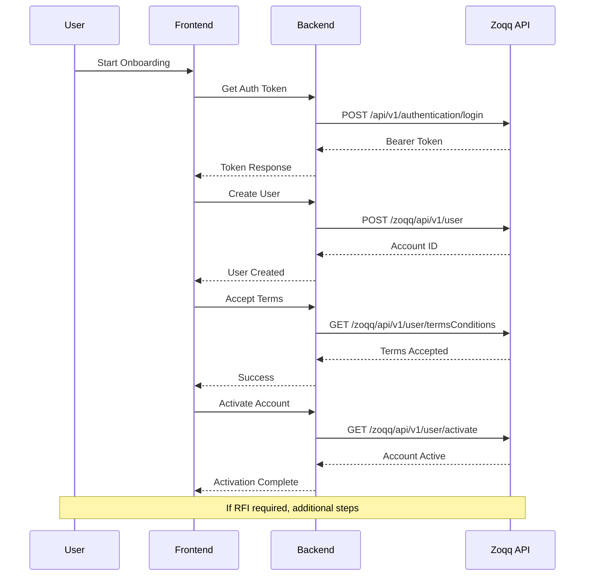

# 🚀 StyloPay Zoqq API Integration

A production-ready implementation of the Zoqq API for secure banking and finance operations. This integration provides complete user onboarding, authentication, and compliance features following the official Zoqq API documentation.

## 📋 Features

✅ **Complete API Coverage**
- Authentication with Zoqq API
- User creation with business and personal details  
- Terms and conditions acceptance
- Account activation
- Request for Information (RFI) handling
- Comprehensive validation and error handling

✅ **Production-Ready**
- Security middleware and rate limiting
- Input validation and sanitization
- Comprehensive error handling
- Automatic token management
- Database integration with MongoDB
- Logging and monitoring

✅ **Modern Tech Stack**
- **Backend**: Node.js, Express.js, MongoDB, JWT, Axios
- **Frontend**: React.js, RTK Query, Tailwind CSS
- **Security**: Helmet, CORS, Rate limiting, Input validation

## 🏗️ Architecture

```
┌─────────────────┐    ┌─────────────────┐    ┌─────────────────┐
│  React Frontend │───▶│  Express Backend │───▶│   Zoqq API      │
│  (RTK Query)    │    │  (Routes/Service)│    │   (External)    │
└─────────────────┘    └─────────────────┘    └─────────────────┘
         │                        │                        │
         │                        │                        │
    ┌────▼────┐              ┌────▼────┐              ┌────▼────┐
    │  Redux  │              │ MongoDB │              │  Auth   │
    │  Store  │              │Database │              │ Tokens  │
    └─────────┘              └─────────┘              └─────────┘
```

## 🚀 Quick Start

### 1. Clone and Setup

```bash
# Clone the repository
git clone <repository-url>
cd stylopay

# Run the automated setup script
node setup-zoqq-integration.js
```

The setup script will:
- 📝 Configure environment variables
- 🔧 Install dependencies (optional)
- 🔌 Test Zoqq API connection
- 📋 Create sample data files

### 2. Manual Setup (Alternative)

If you prefer manual setup:

```bash
# Backend setup
cd backend
cp env-template.txt .env
# Edit .env with your Zoqq credentials
npm install

# Frontend setup  
cd ../frontend
cp env-template.txt .env
# Edit .env with your API URLs
npm install
```

### 3. Configure Zoqq Credentials

Add your Zoqq credentials to `backend/.env`:

```bash
ZOQQ_CLIENT_ID=your-zoqq-client-id
ZOQQ_API_KEY=your-zoqq-api-key  
ZOQQ_PROGRAM_ID=your-program-id
```

> 📞 **Get Credentials**: Contact Zoqq support team for your API credentials

### 4. Start the Application

```bash
# Terminal 1: Start backend
cd backend
npm run dev

# Terminal 2: Start frontend  
cd frontend
npm run dev
```

The application will be available at:
- **Frontend**: http://localhost:5173
- **Backend**: http://localhost:5000
- **API Docs**: http://localhost:5000/api/zoqq/status

## 🔧 API Endpoints

### Authentication
```http
POST /api/zoqq/auth/token
# Get Zoqq authentication token
```

### User Management
```http
POST /api/zoqq/user/create
# Create user with business and personal details

GET /api/zoqq/user/:userId  
# Get user details

POST /api/zoqq/user/:userId/terms
# Accept terms and conditions

POST /api/zoqq/user/:userId/activate
# Activate user account

GET /api/zoqq/user/:userId/rfi
# Get RFI (Request for Information) details

POST /api/zoqq/user/:userId/rfi
# Respond to RFI request
```

### Status
```http
GET /api/zoqq/status
# Check Zoqq integration status
```

## 📝 Usage Examples

### Frontend (React Components)

```jsx
import {
  useCreateZoqqUserMutation,
  useGetZoqqUserQuery,
  useAcceptTermsMutation,
  useActivateAccountMutation
} from '../store/api/zoqqApi';

function ZoqqOnboarding() {
  const [createUser] = useCreateZoqqUserMutation();
  const [acceptTerms] = useAcceptTermsMutation();
  const [activateAccount] = useActivateAccountMutation();

  const handleCreateUser = async (userData) => {
    try {
      const result = await createUser(userData).unwrap();
      console.log('User created:', result.data.accountId);
    } catch (error) {
      console.error('Failed to create user:', error);
    }
  };

  // ... component implementation
}
```

### Backend (API Usage)

```javascript
const ZoqqAuthService = require('../services/zoqqAuth');
const zoqqService = new ZoqqAuthService();

// Get authentication token
const authResult = await zoqqService.getZoqqToken();

// Create user
const userResult = await zoqqService.createUser(userData, authResult.token);

// Accept terms
const termsResult = await zoqqService.acceptTermsAndConditions(userId, authResult.token);

// Activate account
const activationResult = await zoqqService.activateAccount(userId, authResult.token);
```

### cURL Testing

```bash
# 1. Get authentication token
curl -X POST "http://localhost:5000/api/zoqq/auth/token" \
  -H "Authorization: Bearer your-jwt-token"

# 2. Create user
curl -X POST "http://localhost:5000/api/zoqq/user/create" \
  -H "Authorization: Bearer your-jwt-token" \
  -H "Content-Type: application/json" \
  -d @sample-user-data.json

# 3. Accept terms
curl -X POST "http://localhost:5000/api/zoqq/user/ACCOUNT_ID/terms" \
  -H "Authorization: Bearer your-jwt-token"

# 4. Activate account
curl -X POST "http://localhost:5000/api/zoqq/user/ACCOUNT_ID/activate" \
  -H "Authorization: Bearer your-jwt-token"
```

## 📊 User Onboarding Flow



## 🔒 Security Features

### 1. **Authentication & Authorization**
- JWT tokens with 30-minute expiration
- Automatic token refresh
- Bearer token validation
- Session management

### 2. **Input Validation**
- 32+ required fields validation
- Email format validation
- Date range validation
- Enum value validation
- File upload validation

### 3. **Security Headers**
- All Zoqq-required headers
- Idempotency keys for safe retries
- CORS configuration
- Rate limiting

### 4. **Data Protection**
- Input sanitization
- SQL injection prevention
- XSS protection
- Helmet security middleware

## 🧪 Testing

### Unit Tests
```bash
# Backend tests
cd backend
npm test

# Frontend tests  
cd frontend
npm test
```

### Integration Tests
```bash
# Test Zoqq connection
node setup-zoqq-integration.js

# Test API endpoints
npm run test:integration
```

### Manual Testing
Use the sample data file `sample-user-data.json` for testing:

```json
{
  "emailId": "testuser@example.com",
  "businessName": "Sample Business Pty Ltd",
  "firstName": "John",
  "lastName": "Doe",
  // ... all required fields
}
```

## 📈 Monitoring & Logging

### Logging Format
```javascript
[ZOQQ AUTH] Requesting authentication token...
[ZOQQ USER] Creating user account for: user@example.com  
[ZOQQ TERMS] Terms accepted successfully for user: ACCOUNT_ID
[ZOQQ ACTIVATE] Account activated successfully
```

### Performance Monitoring
- Request/response timing
- Token expiration tracking
- API success/failure rates
- Error classification

## 🚨 Error Handling

### Error Response Format
```json
{
  "status": "error",
  "message": "Descriptive error message",
  "code": "ERROR_CODE",
  "errors": []
}
```

### Common Error Codes
- `ZOQQ_DISABLED` - Integration not enabled
- `ZOQQ_AUTH_INVALID` - Invalid credentials
- `MISSING_REQUIRED_FIELDS` - Validation failed  
- `USER_EXISTS` - User already has account
- `RFI_REQUIRED` - Additional info needed

## 🔧 Configuration

### Environment Variables

**Backend (.env)**
```bash
# Required
ZOQQ_CLIENT_ID=your-client-id
ZOQQ_API_KEY=your-api-key
ZOQQ_PROGRAM_ID=your-program-id
JWT_SECRET=your-jwt-secret
MONGODB_URI=your-mongodb-uri

# Optional
ZOQQ_BASE_URL=https://api.zoqq.com
PORT=5000
NODE_ENV=development
```

**Frontend (.env)**  
```bash
VITE_API_BASE_URL=http://localhost:5000/api
VITE_APP_NAME=StyloPay
```

### Database Setup

The application uses MongoDB with the following collections:
- `users` - User accounts with Zoqq integration
- `sessions` - User sessions and tokens

```javascript
// User schema includes Zoqq fields
{
  zoqqAccountId: String,
  zoqqAccountStatus: String,
  zoqqTokenExpiresAt: Date,
  // ... other fields
}
```

## 🚀 Production Deployment

### 1. Environment Setup
```bash
# Production environment variables
NODE_ENV=production
MONGODB_URI=mongodb+srv://...
ZOQQ_CLIENT_ID=production-client-id
ZOQQ_API_KEY=production-api-key
```

### 2. Security Checklist
- [ ] Use production MongoDB instance
- [ ] Configure CORS for production domains
- [ ] Set up SSL/TLS certificates
- [ ] Configure proper rate limiting
- [ ] Set up monitoring and alerting
- [ ] Review and test all API endpoints

### 3. Deployment Commands
```bash
# Build frontend
cd frontend && npm run build

# Start production backend
cd backend && npm start
```

## 📚 Documentation

- **[API Implementation](ZOQQ_API_IMPLEMENTATION.md)** - Complete API documentation
- **[Testing Guide](TESTING_GUIDE.md)** - Testing procedures  
- **[Zoqq Official Docs](https://docs.zoqq.com)** - Official API documentation

## 🤝 Support

### Zoqq Support
- 📧 Contact Zoqq support for API credentials
- 📖 Refer to official Zoqq documentation
- 🔧 Use their developer portal for testing

### Development Support
- 🐛 Check the error logs for debugging
- 📊 Use the status endpoint for health checks
- 🧪 Test with sample data first

## 📄 License

This project is licensed under the MIT License. See LICENSE file for details.

## 🙏 Contributing

1. Fork the repository
2. Create a feature branch
3. Add tests for new features  
4. Ensure all tests pass
5. Submit a pull request

---

**⚡ Ready to integrate with Zoqq?**

Run the setup script and start building secure banking applications!

```bash
node setup-zoqq-integration.js
``` 