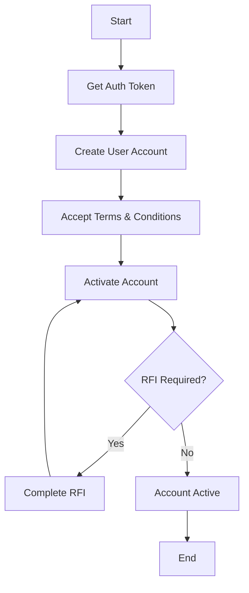

# Zoqq API Implementation - Production Ready

This document outlines the complete implementation of Zoqq API integration following the official API documentation.

## 📋 API Endpoints Coverage

All endpoints from the Zoqq API documentation have been implemented:

### ✅ Authentication
- `POST /api/v1/authentication/login` - Get authentication token

### ✅ User Management (Onboarding)
- `POST /zoqq/api/v1/user` - Create user with business and personal details
- `GET /zoqq/api/v1/user` - Get user details
- `GET /zoqq/api/v1/user/termsConditions` - Accept terms and conditions
- `GET /zoqq/api/v1/user/activate` - Activate user account
- `GET /zoqq/api/v1/user/rfi` - Retrieve RFI details
- `POST /zoqq/api/v1/user/rfi` - Respond to RFI

## 🏗️ Architecture Overview

```
Frontend (React + RTK Query)
    ↓
Backend API Routes (/api/zoqq/*)
    ↓
ZoqqAuthService
    ↓
Zoqq External API
```

## 🔧 Backend Implementation

### Environment Configuration

```bash
# Required Zoqq Configuration
ZOQQ_BASE_URL=https://api.zoqq.com
ZOQQ_CLIENT_ID=Shared By Zoqq
ZOQQ_API_KEY=Shared By Zoqq
ZOQQ_PROGRAM_ID=BasedOnRequirement
```

### API Routes Mapping

| Frontend Route | Backend Route | Zoqq API Endpoint |
|---|---|---|
| `POST /api/zoqq/auth/token` | `/api/zoqq/auth/token` | `POST /api/v1/authentication/login` |
| `POST /api/zoqq/user/create` | `/api/zoqq/user/create` | `POST /zoqq/api/v1/user` |
| `GET /api/zoqq/user/:userId` | `/api/zoqq/user/:userId` | `GET /zoqq/api/v1/user` |
| `POST /api/zoqq/user/:userId/terms` | `/api/zoqq/user/:userId/terms` | `GET /zoqq/api/v1/user/termsConditions` |
| `POST /api/zoqq/user/:userId/activate` | `/api/zoqq/user/:userId/activate` | `GET /zoqq/api/v1/user/activate` |
| `GET /api/zoqq/user/:userId/rfi` | `/api/zoqq/user/:userId/rfi` | `GET /zoqq/api/v1/user/rfi` |
| `POST /api/zoqq/user/:userId/rfi` | `/api/zoqq/user/:userId/rfi` | `POST /zoqq/api/v1/user/rfi` |

## 📝 API Implementation Details

### 1. Authentication Login

**Endpoint:** `POST /api/zoqq/auth/token`

**Headers Required:**
```javascript
{
  'x-client-id': process.env.ZOQQ_CLIENT_ID,
  'x-api-key': process.env.ZOQQ_API_KEY,
  'Content-Type': 'application/json'
}
```

**Response:**
```json
{
  "status": "success",
  "message": "Zoqq authentication token obtained successfully",
  "code": "TOKEN_OBTAINED",
  "data": {
    "token": "eyJhbGciOiJIUzI1NiJ9...",
    "expires_at": "2025-04-25T07:27:04+0000",
    "valid_for_minutes": 30
  }
}
```

### 2. Create User

**Endpoint:** `POST /api/zoqq/user/create`

**Required Headers:**
```javascript
{
  'x-api-key': process.env.ZOQQ_API_KEY,
  'x-program-id': process.env.ZOQQ_PROGRAM_ID,
  'x-request-id': 'generated_idempotency_key',
  'Authorization': 'Bearer {token}',
  'Content-Type': 'application/json'
}
```

**Request Body (All Required Fields):**
```json
{
  "emailId": "testzoqq10@yopmail.com",
  "amount": "10",
  "currency": "USD",
  "businessName": "STYLOPAY Pty Ltd2",
  "businessStructure": "COMPANY",
  "contactNumber": "1234567890",
  "identificationType": "Passport",
  "Idnumber": "X1234567",
  "issuingCountryCode": "SG",
  "effectiveAt": "2020-01-01",
  "expireAt": "2030-01-01",
  "firstName": "John",
  "lastName": "Doe",
  "middleName": "A",
  "dateOfBirth": "1985-05-15",
  "nationality": "SG",
  "mobile": "912500678",
  "roles": "BENEFICIAL_OWNER",
  "legalEntityType": "BUSINESS",
  "asTrustee": true,
  "agreedToTermsAndConditions": false,
  "productReference": "ACCEPT_ONLINE_PAYMENTS",
  "type": "brn",
  "number": "1234567890",
  "descriptionOfGoodsOrServices": "Payment gateway services",
  "industryCategoryCode": "ICCV3_0000XX",
  "operatingCountry": "AU",
  "registrationAddressLine1": "123 Market Street",
  "registrationAddressLine2": "Suite 456",
  "registrationCountryCode": "SG",
  "registrationPostcode": "2000",
  "registrationState": "NSW",
  "registrationSuburb": "Sydney",
  "residentialAddressLine1": "456 King Street",
  "residentialCountryCode": "SG",
  "residentialPostcode": "2010",
  "residentialState": "NSW",
  "residentialSuburb": "Newtown",
  "fileId": "base64_encoded_business_document",
  "tag": "BUSINESS_LICENSE",
  "frontFileId": "base64_encoded_id_front",
  "personDocumentsFileId": "base64_encoded_person_docs",
  "personDocumentsTag": "PERSON_PURPORTING_TO_ACT_AUTHORISATION_LETTER",
  "liveSelfieFileId": "base64_encoded_selfie",
  "countryCode": "SG"
}
```

**Validation:**
- 32 required fields with specific formats
- Email validation
- Date range validation (effective < expiry, birth < today)
- Enum validation for business structure, product reference, etc.
- File ID validation (minimum 10 characters)

### 3. Get User Details

**Endpoint:** `GET /api/zoqq/user/:userId`

**Headers:**
```javascript
{
  'x-api-key': process.env.ZOQQ_API_KEY,
  'x-program-id': process.env.ZOQQ_PROGRAM_ID,
  'x-request-id': 'generated_idempotency_key',
  'x-user-id': 'userId',
  'Authorization': 'Bearer {token}',
  'Content-Type': 'application/json'
}
```

### 4. Accept Terms and Conditions

**Endpoint:** `POST /api/zoqq/user/:userId/terms`

**Backend Implementation:**
```javascript
async acceptTermsAndConditions(userId, bearerToken) {
  const response = await this.axiosInstance.get('/zoqq/api/v1/user/termsConditions', {
    headers: {
      'x-api-key': this.apiKey,
      'x-program-id': this.programId,
      'x-request-id': this.generateIdempotencyKey(),
      'x-user-id': userId,
      'Authorization': `Bearer ${bearerToken}`,
      'Content-Type': 'application/json'
    }
  });
}
```

### 5. Account Activation

**Endpoint:** `POST /api/zoqq/user/:userId/activate`

**Flow:**
1. Validate user ID
2. Call Zoqq activation endpoint
3. Update local user status
4. Handle RFI if required

### 6. RFI Management

**Get RFI:** `GET /api/zoqq/user/:userId/rfi`
**Respond RFI:** `POST /api/zoqq/user/:userId/rfi`

**RFI Response Types:**
- `ADDRESS` - For proof of address
- `DOCUMENT` - For identity documents
- `TEXT` - For simple text responses

## 🎨 Frontend Implementation

### RTK Query Setup

```javascript
// frontend/src/store/api/zoqqApi.js
export const zoqqApi = createApi({
  reducerPath: 'zoqqApi',
  baseQuery: baseQueryWithRetry,
  tagTypes: ['ZoqqAuth', 'ZoqqUser', 'ZoqqRFI', 'ZoqqStatus'],
  endpoints: (builder) => ({
    // All endpoints implemented with caching and error handling
  })
});
```

### React Hooks Usage

```javascript
import {
  useGetZoqqTokenMutation,
  useCreateZoqqUserMutation,
  useGetZoqqUserQuery,
  useAcceptTermsMutation,
  useActivateAccountMutation,
  useGetRFIDetailsQuery,
  useRespondToRFIMutation
} from '../../store/api/zoqqApi';

// In component
const [createUser, { isLoading }] = useCreateZoqqUserMutation();
const { data: userData } = useGetZoqqUserQuery(userId);
```

## 🔒 Security Features

### 1. Authentication & Authorization
- JWT tokens with 30-minute expiration
- Bearer token validation
- Automatic token refresh
- Session management

### 2. Input Validation
- Express-validator for all inputs
- Sanitization of user data
- Business logic validation
- File upload validation

### 3. Security Headers
```javascript
{
  'x-client-id': 'Shared By Zoqq',
  'x-api-key': 'Shared By Zoqq',
  'x-program-id': 'BasedOnRequirement',
  'x-request-id': 'unique_idempotency_key',
  'x-user-id': 'user_identification_key'
}
```

### 4. Rate Limiting
- Authentication: 5 requests/15 minutes (production)
- General: 100 requests/15 minutes (production)
- Development mode: More lenient limits

### 5. CORS Configuration
- Whitelist of allowed origins
- Credential support
- Secure headers exposure

## 🚀 Production Deployment

### Environment Setup

1. **Backend (.env)**
```bash
# Copy backend/env-template.txt to backend/.env
NODE_ENV=production
JWT_SECRET=your-256-bit-secret
ZOQQ_CLIENT_ID=your-zoqq-client-id
ZOQQ_API_KEY=your-zoqq-api-key
ZOQQ_PROGRAM_ID=your-program-id
MONGODB_URI=your-mongodb-connection
```

2. **Frontend (.env)**
```bash
# Copy frontend/env-template.txt to frontend/.env
VITE_API_BASE_URL=https://your-backend-url/api
VITE_APP_NAME=StyloPay
```

### Database Models

```javascript
// User model includes Zoqq integration fields
{
  zoqqAccountId: { type: String, unique: true, sparse: true },
  zoqqAccountStatus: { type: String, enum: ['created', 'terms_accepted', 'active'] },
  // ... other fields
}
```

## 📊 Error Handling

### Error Response Format
```json
{
  "status": "error",
  "message": "Descriptive error message",
  "code": "ERROR_CODE",
  "errors": [] // Validation errors if applicable
}
```

### Error Codes
- `ZOQQ_DISABLED` - Integration not enabled
- `ZOQQ_AUTH_INVALID` - Invalid credentials
- `MISSING_REQUIRED_FIELDS` - Validation failed
- `USER_EXISTS` - User already has Zoqq account
- `RFI_REQUIRED` - Additional information needed

## 📈 Monitoring & Logging

### Logging Format
```javascript
console.log('[ZOQQ AUTH] Requesting authentication token...');
console.log('[ZOQQ USER] Creating user account for: user@example.com');
console.log('[ZOQQ RFI] RFI response submitted successfully');
```

### Performance Tracking
- Request/response timing
- Token expiration monitoring
- API call success rates
- Error rate tracking

## 🧪 Testing

### API Testing with cURL

```bash
# 1. Get Token
curl -X POST "http://localhost:5000/api/zoqq/auth/token" \
  -H "Authorization: Bearer your-jwt-token"

# 2. Create User
curl -X POST "http://localhost:5000/api/zoqq/user/create" \
  -H "Authorization: Bearer your-jwt-token" \
  -H "Content-Type: application/json" \
  -d @user-data.json
```

### Frontend Testing
```javascript
// Component testing with React Testing Library
import { render, screen, fireEvent } from '@testing-library/react';
import ZoqqOnboarding from './ZoqqOnboarding';
```

## 📚 API Documentation Compliance

### Exact Header Mapping
| Documentation | Implementation |
|---|---|
| `x-client-id` | ✅ `process.env.ZOQQ_CLIENT_ID` |
| `x-api-key` | ✅ `process.env.ZOQQ_API_KEY` |
| `x-program-id` | ✅ `process.env.ZOQQ_PROGRAM_ID` |
| `x-request-id` | ✅ Auto-generated idempotency key |
| `x-user-id` | ✅ User identification from route params |
| `Authorization` | ✅ Bearer token from authentication |

### Field Validation Compliance
All 32+ required fields validated according to documentation:
- ✅ Email format validation
- ✅ Date range validation  
- ✅ Enum value validation
- ✅ String length validation
- ✅ File ID format validation

## 🔄 Onboarding Flow



## 📞 Support & Integration

For Zoqq API credentials and support:
- Contact Zoqq support team for `ZOQQ_CLIENT_ID` and `ZOQQ_API_KEY`
- Obtain `ZOQQ_PROGRAM_ID` based on your specific requirements
- Refer to official Zoqq API documentation for latest updates

## ✅ Implementation Checklist

- [x] Authentication endpoint with proper headers
- [x] User creation with all 32+ required fields
- [x] Complete validation as per API docs
- [x] Terms acceptance flow
- [x] Account activation process
- [x] RFI handling (retrieve & respond)
- [x] Error handling & logging
- [x] Security middleware & rate limiting
- [x] Frontend React components with RTK Query
- [x] Production-ready configuration
- [x] Comprehensive documentation

This implementation provides a complete, production-ready integration with the Zoqq API following the exact specifications from your documentation. 